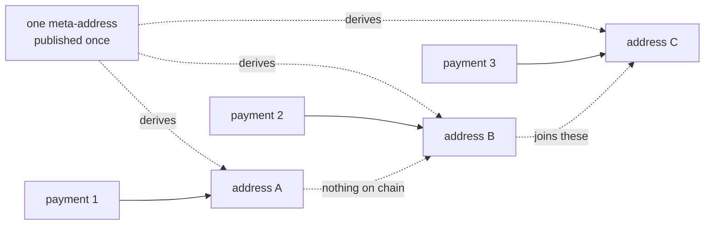

# @verdet/stealth

**Receive money without handing over a history.** Stealth addresses, linkable ring signatures,
sigma-protocol proofs and oblivious transfer, over secp256k1, in one package with two
dependencies.

[](#running-it)
[](#running-it)
[](#the-dependency-list-in-full)
[](LICENSE)

This is the derivation layer behind [verdet.app](https://verdet.app), a privacy wallet for
tokenized equities. It is open on purpose: **an implementation nobody can read is a claim, and a
claim is not what you want standing between you and your keys.**

---

## The thing it is for

On a public chain your address is a permanent record of what you hold, who you trade with, and
every position you ever built. Everything here exists to break one link in that record.



The dotted links on the right do not exist. That is the whole product, and the rest of this
package is about what you can still prove, disclose and withhold once they are gone.

---

## Install

```bash
npm install @verdet/stealth
```

```ts
import { generateStealthKeys, deriveRequest } from '@verdet/stealth'

const wallet = generateStealthKeys()

// One address for one payer. Nothing about it outlives the payment.
const invoice = deriveRequest(wallet, 0)

console.log(invoice.stealthAddress) // 0x… give this to whoever is paying you
console.log(invoice.privateKey)     // derived, never stored, never sent
```

There is no configuration, no network call and no state. Every address regenerates from the two
keys and an index, so a wallet restored on another machine walks the numbers and finds all of them
again.

### Checking what you were given

Every release is published from CI with [npm provenance][prov], so you can check that the tarball
you received was built by a public workflow from a public commit rather than uploaded by somebody:

```bash
npm audit signatures
```

That is an answer rather than a promise, which is the same thing this library does everywhere
else. **The source ships in the tarball too**, so the code you audit is the code you installed
without cloning anything.

[prov]: https://docs.npmjs.com/generating-provenance-statements

---

## What is in it

| Module | What it does | Tests |
|---|---|--:|
| [`derive`](src/derive.ts) · [`keys`](src/keys.ts) · [`meta-address`](src/meta-address.ts) | ERC-5564 scheme 1: ECDH shared secrets, view tags, stealth addresses | 11 |
| [`request`](src/request.ts) | Payments with **no announcement**, because the recipient picks the ephemeral key | 9 |
| [`watch`](src/watch.ts) | Watch-only grants. See everything, move nothing | 11 |
| [`scope`](src/scope.ts) | Hand over one period and reach nothing outside it | 14 |
| [`ring`](src/ring.ts) | Linkable ring signatures. Act once, counted, unnamed | 16 |
| [`prove`](src/prove.ts) | Schnorr and Chaum-Pedersen proofs with Fiat-Shamir | 18 |
| [`oblivious`](src/oblivious.ts) | Chou-Orlandi 1-of-N oblivious transfer | 12 |
| [`vault`](src/vault.ts) | Passphrase-wrapped key storage, PBKDF2 into AES-GCM | 8 |
| [`permit`](src/permit.ts) | EIP-2612 permits, so a gasless address can still move its token | 9 |
| [`backup`](src/backup.ts) | Printable key backup with a fingerprint per key | 14 |
| [`notes`](src/notes.ts) | Labels sealed under the viewing key | 11 |
| [`announcer`](src/announcer.ts) · [`registry`](src/registry.ts) | ERC-5564 and ERC-6538 call encoding | 12 |
| [`interop`](test/interop.test.mjs) | The published vector, so another implementation can check itself | 6 |

---

## The four things worth reading the code for

<details>
<summary><b>Private requests: being paid with no announcement at all</b></summary>

Every stealth scheme has the same hole, and it is not on chain. A meta-address is joined to nothing
by the ledger and is a **persistent identifier off it**: give it to ten payers and those ten can
compare notes and know they are paying one person.

A request closes that. Your wallet derives the address, so the payer receives one address and
nothing that survives the payment.

```ts
import { deriveRequests } from '@verdet/stealth'

// Hand request 0 to one payer, request 1 to the next. They share nothing.
const [first, second] = deriveRequests(wallet, 2)
```

And because you chose the ephemeral key, **nothing has to be announced**. What lands on chain is
one ordinary transfer to one ordinary-looking address, with no marker that a privacy tool was
involved.

> [!NOTE]
> This is interactive: a request has to be handed over. The published meta-address stays for the
> cases where that is impossible, and both modes use the same derivation.

</details>

<details>
<summary><b>Scoped disclosure: your accountant gets last quarter, and only last quarter</b></summary>

Every other wallet answers a disclosure request with a full export and a promise. A scoped viewing
key opens one label and reaches nothing else, because there is no path from `vk(label)` back to the
master.

```ts
import { keysForScope, scopedWatchKeys, encodeWatchKey } from '@verdet/stealth'

// Create requests inside a period.
const q3 = keysForScope(wallet, '2026-Q3')

// Hand over that period, and nothing else.
const grant = encodeWatchKey(scopedWatchKeys(wallet, '2026-Q3'))
```

The grant carries the label and a version byte, so a holder can tell a scoped key from a whole
wallet **by reading the bytes** rather than by being told.

</details>

<details>
<summary><b>Ring signatures: prove you are one of them, act once, stay unnamed</b></summary>

```ts
import { ringSign, ringVerify, sameSigner } from '@verdet/stealth'

const signature = ringSign(message, ring, mySecret, myIndex)

ringVerify(message, ring, signature) // true, and says nothing about which member
sameSigner(signature, anotherOne)    // same holder, still unnamed
```

The key image is constant for a signer across **every** ring they ever appear in, so one action per
holder can be counted by somebody who cannot identify any of them. That is the shape of a claim, a
vote or a redemption that needs no list of who is entitled.

</details>

<details>
<summary><b>Oblivious transfer: fetch one record without saying which</b></summary>

The honest hole in any wallet that reads a chain through a server is that the server sees which
addresses you asked about. Splitting the queries helps and does not fix it.

```ts
import { otSenderBegin, otReceiverChoose, otSenderKeys, otReceiverKey } from '@verdet/stealth'

const sender = otSenderBegin()
const receiver = otReceiverChoose(sender.point, 3, 8) // I want record 3 of 8

const keys = otSenderKeys(sender, receiver.request, 8) // sender derives all eight
const mine = otReceiverKey(receiver, sender.point, 8)  // receiver derives exactly one
```

The sender learns nothing about the choice because the request is blinded by a uniform scalar. The
receiver learns nothing about the other seven because that would mean solving Diffie-Hellman.

> [!IMPORTANT]
> This is the key agreement and it stops there. **Encrypting the records is the caller's job**,
> with AES-GCM from the platform. A hand-written authenticated cipher in the path that carries
> somebody's balance is not a trade this project makes.

</details>

---

## What it does not do

Every claim above has an edge, and they are written in the source next to the code that makes
them, not collected in a footer.

> [!WARNING]
> **Amounts and timing are public.** Everything here is about identity and linkage. A transfer is
> still a transfer, with a public amount and a public timestamp, forever.

- **Spending from several addresses joins them.** Receiving privately is the part this does well.
  Paying one bill from three stealth addresses says permanently that one person held all three.
  Nothing here solves that.
- **A ring hides you among exactly as many people as it holds.** A ring of two is a coin flip, and
  a ring whose other members are not plausible signers is a ring of one in a costume. Choosing
  decoys is an operational problem no library solves for you.
- **These are sigma protocols, not SNARKs.** Schnorr and Chaum-Pedersen, made non-interactive with
  Fiat-Shamir. They prove two specific narrow statements. Nothing here is general-purpose, and
  nothing here calls itself a SNARK.
- **Oblivious transfer needs two parties.** The client half is here. Nothing is oblivious until a
  server speaks the other half.
- **A watch key cannot be revoked**, scoped or not. Handing one over is handing it over, the way a
  photograph is.
- **The vault protects a stored copy, not a live page.** A script with access to the origin can
  read the ciphertext and the passphrase as it is typed. Only a separate process changes that.

---

## Security posture

**Primitives come from [@noble](https://github.com/paulmillr/noble-curves), audited, and are not
reimplemented here.** Point arithmetic, hash-to-curve (RFC 9380) and secret-key generation are all
the library's. What this package writes is the protocol layer on top, which is the part worth
reviewing.

Three habits the code keeps, and the tests enforce:

1. **Everything a verifier checks goes into the challenge.** A public value left out of a
   Fiat-Shamir hash is a value an attacker gets to choose afterwards. The tests change each one in
   turn and require the proof to fail.
2. **Fresh nonces, always.** Reusing a nonce across two proofs leaks the secret outright. Tests
   assert that two runs over the same input differ.
3. **Refuse rather than truncate.** A key of the wrong length, a label too long, a ring of one: all
   throw. Silently accepting a shortened key is how a dropped leading zero becomes a different,
   working, wrong wallet.

**This code has not been independently audited.** See [SECURITY.md](SECURITY.md) before using it
with money that matters.

### The dependency list, in full

```
@noble/curves  2.4.0
@noble/hashes  2.4.0
```

That is the whole list, and it is deliberate. Key handling with a deep dependency tree is key
handling you cannot review.

---

## Running it

```bash
npm install
npm test          # builds, then runs 151 tests
npm run build     # type declarations into dist/
```

Node 22 or newer, for the test runner and the WebCrypto globals the vault uses.

The type configuration is stricter than most: `noUncheckedIndexedAccess` and
`exactOptionalPropertyTypes` are both on, because a library that walks byte arrays by index wants a
type system that agrees `array[i]` might not be there, and because a watch key with an explicitly
undefined label is not the same object as one with no label. One of those two means "the whole
wallet".

---

## Interoperability

ERC-5564 does not specify how the shared-secret point is serialised, and three defensible readings
give three different addresses. So this package publishes its vector rather than asserting
compatibility:

```bash
node --test test/interop.test.mjs
```

If you are writing another implementation and it disagrees with that vector, one of us is wrong and
the vector is how we find out which.

---

## Licence

MIT. See [LICENSE](LICENSE).
